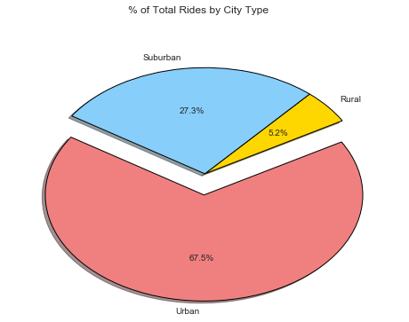

```python
# The internet told me this is important.
%matplotlib inline
```


```python
# Dependencies
import pandas as pd
import numpy as np
import matplotlib.pyplot as plt
import seaborn as sns
```


```python
# Read in csv files, check their headers
city_df = pd.read_csv("raw_data/city_data.csv")
ride_df = pd.read_csv("raw_data/ride_data.csv")
```


```python
# Merge the dataframes, check the header
join_df = pd.merge(city_df, ride_df, on="city")
```


```python
# Group by the city name to get data per city
city_group = join_df.groupby("city")
city_group.head()

# Average fare ($) per city
city_fare = city_group["fare"].mean()

# Total Number of rides per city
city_rides = city_group["ride_id"].count()

# Total number of drivers per city
city_drivers = city_group["driver_count"].unique()
city_drivers = city_drivers.str[0]

# City Type (Urban, Suburban, Rural)
city_type = city_group["type"].unique()
city_type = city_type.str[0]
```


```python
# Urban, Suburban, Rural
# urban_df = join_df.loc[join_df["type"] == "Urban",:]
# suburban_df = join_df.loc[join_df["type"] == "Suburban",:]
# rural_df = join_df.loc[join_df["type"] == "Rural",:]
```


```python
# Make a bubble plot

# Set up colors, axes, figure
color_dict = {"Urban": "#f08080", "Suburban": "#87cefa", "Rural": "gold"}
fig, ax = plt.subplots(figsize=(8, 5.5))
fig.suptitle("Pyber Ride Sharing Data (2016)", fontweight="bold")

# Set figure axis limits
ax.set_xlim(0,40)
ax.set_ylim(15, 45)

# Make our scatter plot with various numbers tweaked
ax.scatter(city_rides, city_fare, marker="o", color = [color_dict[i] for i in city_type], edgecolors="black", alpha=0.8, s=city_drivers*10, label="City Types")
ax.set_xlabel("Total Number of Rides (Per City)")
ax.set_ylabel("Average Fare ($)")

# Copied from stackoverflow, toy with this later to see how it works
markers = [plt.Line2D([0,0],[0,0],color=color, marker='o', linestyle='') for color in color_dict.values()]
plt.legend(markers, color_dict.keys(), title="City Types", numpoints=1, loc="best")

# Use seaborn to set a style
sns.set_style("darkgrid")

# Show the bubble plot
plt.show()
```


```python
# Make the following 3 pie charts:
colors = ["gold", "lightskyblue", "lightcoral"]
type_group = join_df.groupby("type")

# % of total fares by city type
total_fares = type_group["fare"].sum()
fig, ax = plt.subplots(figsize=(8, 5.5))

fig.suptitle("% of Total Fares by City Type")

pies = ax.pie(total_fares, explode=(0, 0, 0.2), autopct="%.1f%%", shadow=True, labels=total_fares.index, startangle=30, colors=colors)

for pie_wedge in pies[0]:
    pie_wedge.set_edgecolor('black')
    pie_wedge.set_linewidth(1)

plt.show()
```


```python
# % of total rides by city type
total_rides = type_group["ride_id"].count()
fig, ax = plt.subplots(figsize=(8, 5.5))

fig.suptitle("% of Total Rides by City Type")

pies = ax.pie(total_rides, explode=(0, 0, 0.2), autopct="%.1f%%", shadow=True, labels=total_fares.index, startangle=30, colors=colors)

for pie_wedge in pies[0]:
    pie_wedge.set_edgecolor('black')
    pie_wedge.set_linewidth(1)
```


```python
# % of total drivers by city type
total_rides = type_group["driver_count"].sum()
fig, ax = plt.subplots(figsize=(8, 5.5))

fig.suptitle("% of Total Rides by City Type")

pies = ax.pie(total_rides, explode=(0, 0, 0.2), autopct="%.1f%%", shadow=True, labels=total_fares.index, startangle=60, colors=colors)

for pie_wedge in pies[0]:
    pie_wedge.set_edgecolor('black')
    pie_wedge.set_linewidth(1)
```




